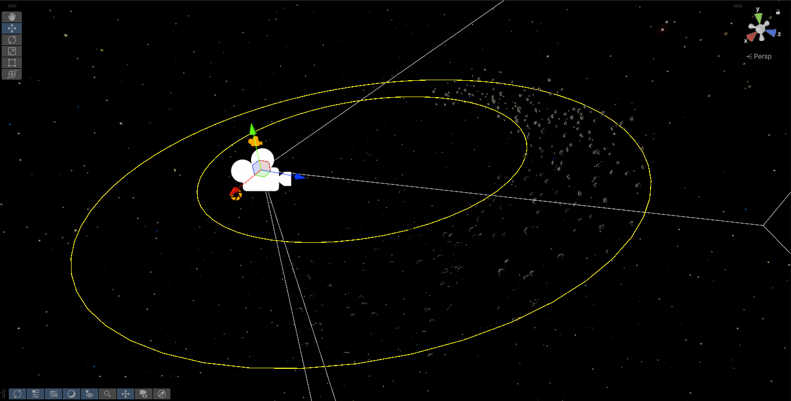
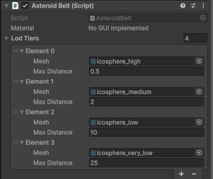

# Asteroid Belt Component

## Belt Torus Position Generation

A modified best-candidate algorithm is used to generate unique non-intersecting asteroid positions within a torus shape
defined by an inner and outer radius.

## Orbit and animation

Asteroids are animated to rotate on their own axis and orbit around the center of the belt. The rotation and orbit speeds can be adjusted in the inspector. 
The rotation is based on a random seed for each asteroid,
while the orbit is based on its unique radius within the belt, so asteroids will maintain consistent rotation and orbit speeds as they move around the scene.

## Frustum Culling

By default, instanced rendering supports frustum culling for the entire batch, so it either draws all asteroid instances
or none. The custom Frustum Culling system in the Asteroid Belt component allows for culling of individual asteroids within the belt, improving performance when only a portion of the belt is visible.

## LOD System

Asteroids are based on vertex displacement of icosphere meshes. THe LOD system uses 4 different icosphere meshes
to minimize the amount of vertices drawn when viewing the entire asteroid ring from a distance, while still maintaining
high detail when viewing individual asteroids up close. The LOD system is based on distance from the camera.

