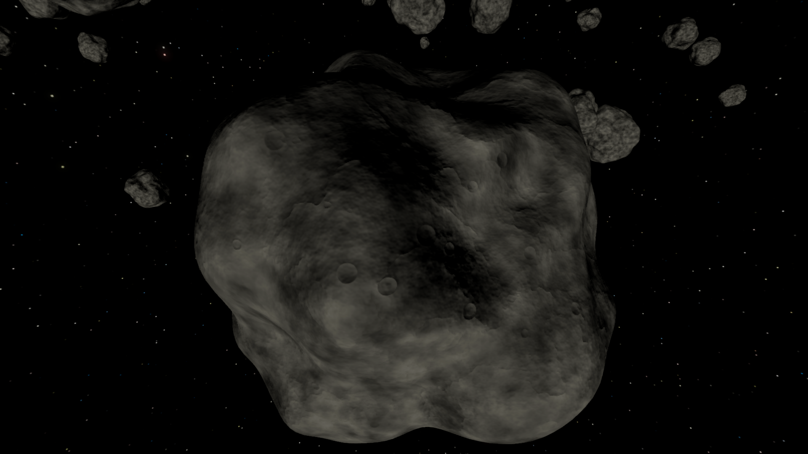
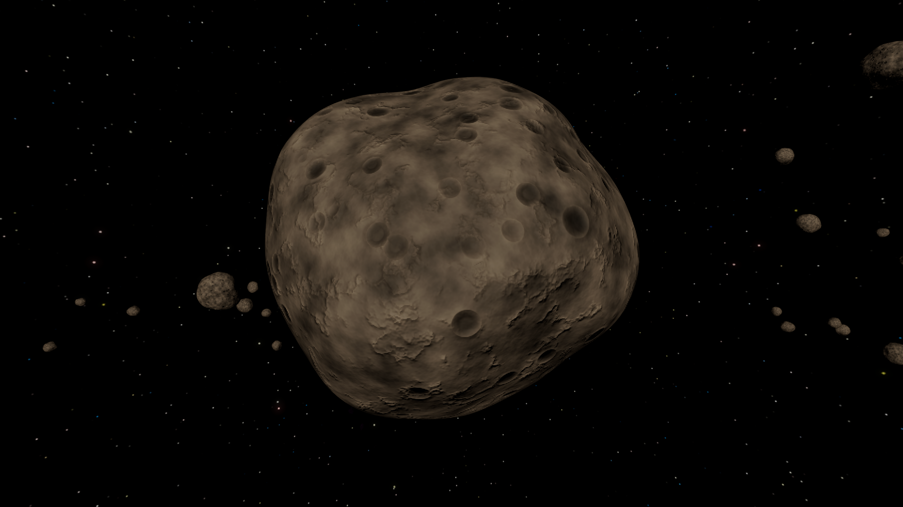

# Asteroid Shader

## Shape Generation
The shape is generated with vertex displacement according to procedural 3D noise. The shader is built for a sphere mesh,
whose vertices are displaced along their normal direction to create the rocky asteroid shape. 4 custom icosphere meshes
of progressively increasing quality are used for this, but the default Unity sphere mesh works as well. These are
used in the [custom LOD system](asteroid-belt-component.md#lod-system) by default.

A unique ID is generated for each asteroid instance and used as a seed for the noise function, 
allowing for unique shapes across multiple instances while still using a single material with GPU instancing for performance.
The custom per-asteroid ID system is currently based on the asteroid's unique radius within the ring, so moving an asteroid around in the scene will change
its shape. This is a workaround to enable frustum culling and LOD buckets to maintain consistent shapes
across draw calls as we can't use the instance ID, which would change.

## Texture Baking

You can [bake asteroid textures](../baking-textures.md) for increased performance.