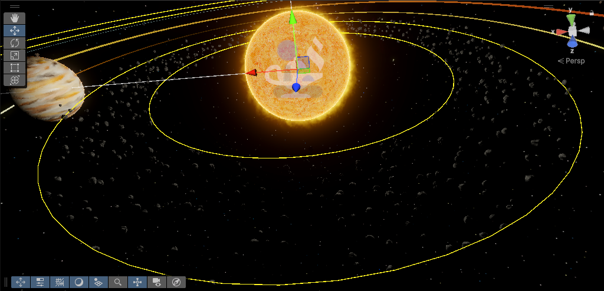
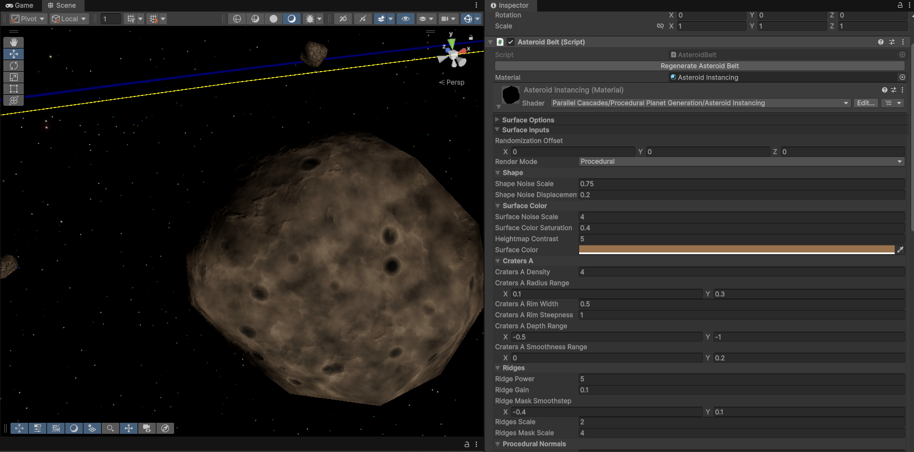
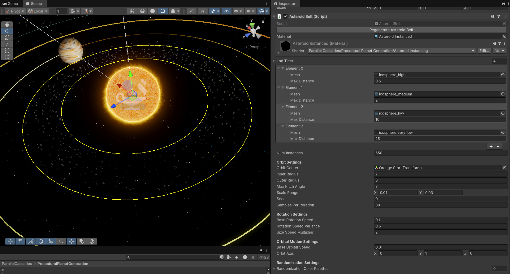

# Asteroid Belts

Asteroid belts use a custom procedural shader with vertex displacement instancing to render 1000s of instances without
affecting performance. They can be created with the "Parallel Cascades > Create Asteroid Belt" menu item.

To edit the appearance of asteroids, you can adjust the asteroid material which is embedded in the Asteroid Belt inspector:

To adjust the whole asteroid belt appearance and andimation - inner and outer radius, instance count and size ranges,
adjust the Asteroid Belt component's fields:

A custom LOD system ensures you are only using a high-resolution mesh when viewing asteroids from up close. This
uses icosphere meshes by default, but you can use your own meshes here.