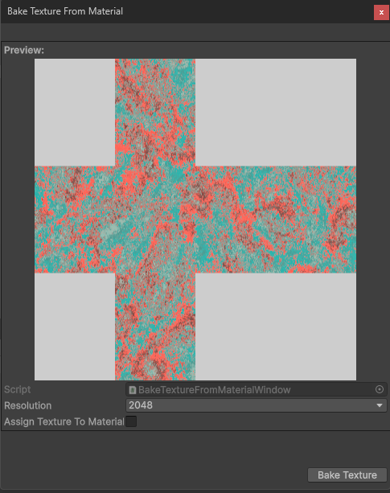

# Texture Baking

Procedural generation reduces memory usage by generating surface detail at runtime, removing the need to include large texture assets in your build. However, this increases GPU load, as shaders must be evaluated each frame.

To balance performance and memory, we have included editor tools for baking procedural spherical materials into static textures. These baked textures can then be used with provided shaders for spherical flow maps and static materials, trading increased memory footprint for improved runtime performance.

## Material context menu item

One way to access the procedural texture baking is by right clicking on the material's inpector window and choosing 'Parallel Cascades > Bake Procedural Material to Cubemap Texture':

Selecting this will open the 'Bake Texture from Material' wizard:

If you tick the `Assign Texture To Material` checkbox, the static texture will be automatically applied to the material, and the material's 'Render Mode' will be changed appropriately:

## Flowmaps

Stars and gas giants can utilise flow maps when in static texture rendering mode, in order to simulate the dynamic flow of the procedural shader. There are a few default flow map texture included in this asset, but you can also create your own with external tools like Photoshop or Flowmap Painter.

When importing these textures in Unity, make sure they are not imported as sRGB textures, as that will read the flow data incorrectly:

