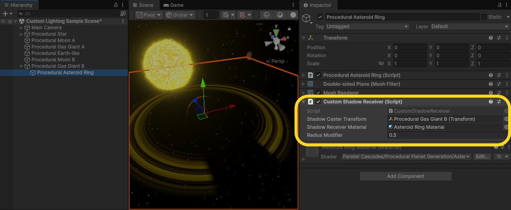

# Custom Space Lighting

## Introduction
You might require space lighting in your scene, where the light source is a central star that lights up all planets omni-directionally:

One way to get space scene lighting is to use a Point light instead of a Directional light and manually adjust the light falloff in the URP source:
https://docs.unity3d.com/6000.2/Documentation/Manual/urp/lighting/custom-lighting-change-light-falloff.html

## Custom Shader Lighting
In order to avoud modifying URP source code and to give more fine-grained control over our space scene lighting, we use a different approach: Custom Shader Lighting. Check out the Custom Lighting Sample Scene to see how this is set-up.

We have a set of variant shaders which are Unlit version of the primary procedural shaders with manual light calculations:

To make your procedural planet materials use the custom lighting, you can switch the shader used through the material inspector:

These have Main Space Light Position and Main Space Light Color as global shader properties. These are automatically managed by the Main Space Light component on the star in the scene:

## Custom Shadows

This simple custom lighting approach does not calculate shadows. In order to have the realtime planet shadow on the planet asteroid ring, we use an analytical shadow calculation. This is also managed by shader properties for the shadow-casting planet size and main light source. Add the Shadow Receiver component on the asteroid ring to manage these:

