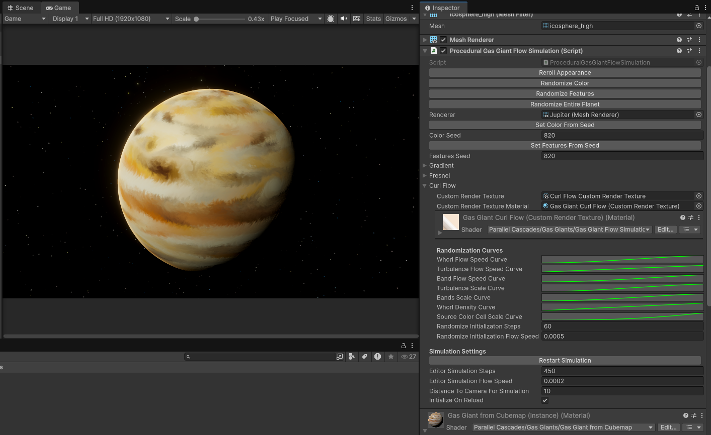
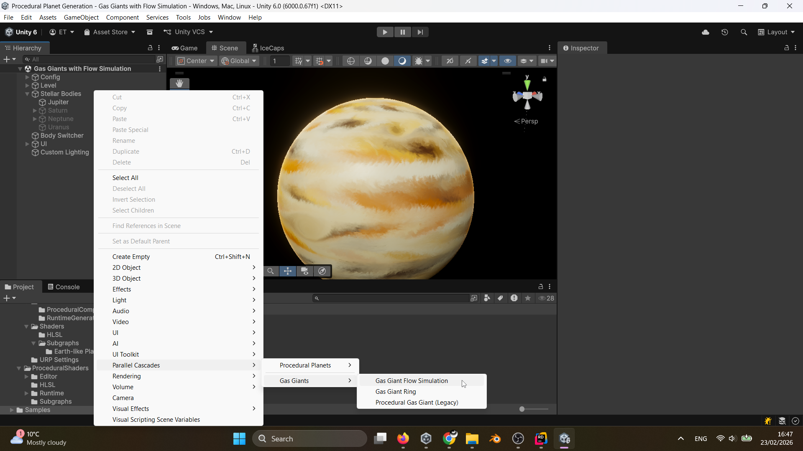
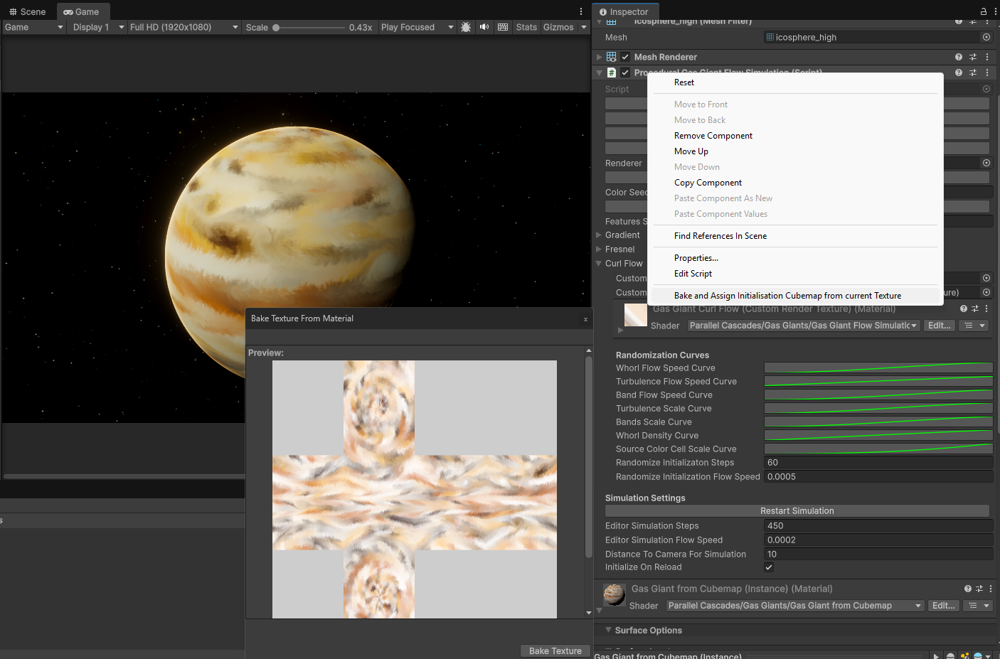
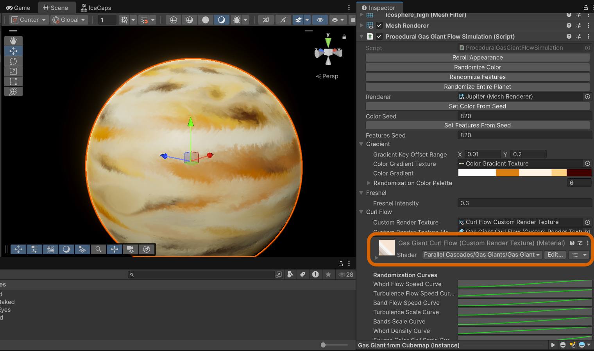
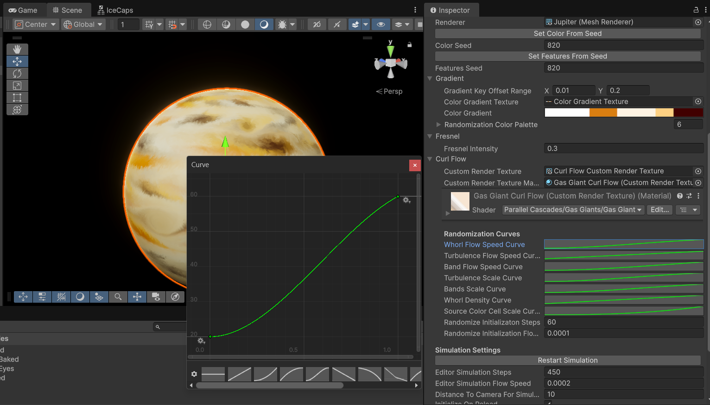

# Curl Gas Giants

The fluid simulation on gas giants is managed by the 'ProceduralGasGiantFlowSimulation' component:

This requires multiple
materials and resources to function correctly, so it's recommended you add gas giants to your scenes through the custom
menu command:

This controls a Custom Render Texture which has the curl material. 
By default, when you enter Play Mode, the simulation will run if the body is on-screen and a certain distance from the camera.
The simulation will pick up from the state it was in when you entered Play Mode, so you can simulate the flow in Edit Mode, and then enter Play Mode to have the simulation continue from that point.

## Curl simulation in the Editor

In Edit Mode, this simulation is paused, and can be
set to run through an editor coroutine. Use the "Restart Simulation" button in the component inspector and set
the Editor Simulation Steps and Editor Simulation Flow Speed properties to control the speed and duration of the simulation.

## Curl simulation at runtime
The 'ProceduralGasGiantFlowSimulation' component controls when the custom render texture is updated - by default,
the simulation will run if the body is on-screen and a certain distance from the camera. 
This allows for multiple gas giants to be in the scene but only simulate flow when looked at up-close for the sake of performance.

The simulation will pick up from the state it was in when you entered Play Mode, so you can simulate the flow in Edit Mode,
and then enter Play Mode to have the simulation continue from that point.

## Setting up persistent gas giants
The custom render texture is reset any time the scene is reloaded or you make a build, so if you want persistent gas giants,
you have two options:

1. [Texture Baking](../baking-textures.md) - Fully bake the gas giant surface to a cubemap texture. This will lose the runtime flow but increase performance.
   Right click on a selected material in the inspector window to bring up the context menu, and select
   "Parallel Cascades > Bake and Apply All Procedural Material Textures". Note that for flow simulation gas giants, which have two materials,
   you can only bake the display material in this way. This will make your gas giant fully static. If you want to preserve
   the flow but have a consistent starting point, use the second option below.

2. Initialization Cubemap Baking - You can bake the state from which the gas giant simulation start from. This will
   allow you to always have the same starting point for your gas giant simulation and still have the animated flow at runtime.
   To do this, right click on the ProceduralGasGiantFlowSimulation component (not the material!) in the inspector window to
   bring up the context window and select "Bake and Assign Initialisation Cubemap from current Texture".

## Customising Gas Giants
You can edit the gas giant properties through the two materials: The display material on the mesh renderer and the
custom render texture material. The custom render texture material's inspector is available in-line in the component inspector for the ProceduralGasGiantFlowSimulation component:

In the custom render texture material you can individually tweak the Flow speeds of the three main curl components or determine
the global flow speed multiplier., 
You can manually tune the scales of the turbulence, banded flow and giant storm spots,
or tweak the randomization probability curves found in the same script to generate randomised values for these properties:

## Custom Render Texture size
The size of the custom render texture used for the curl simulation determines the performance cost. By default,
CRTs are set to be cubemaps with 768 pixels per face. 512 to 1024 pixels per face is a good range to balance performance and visual quality. 
You can adjust these manually through the custom render texture inspector.