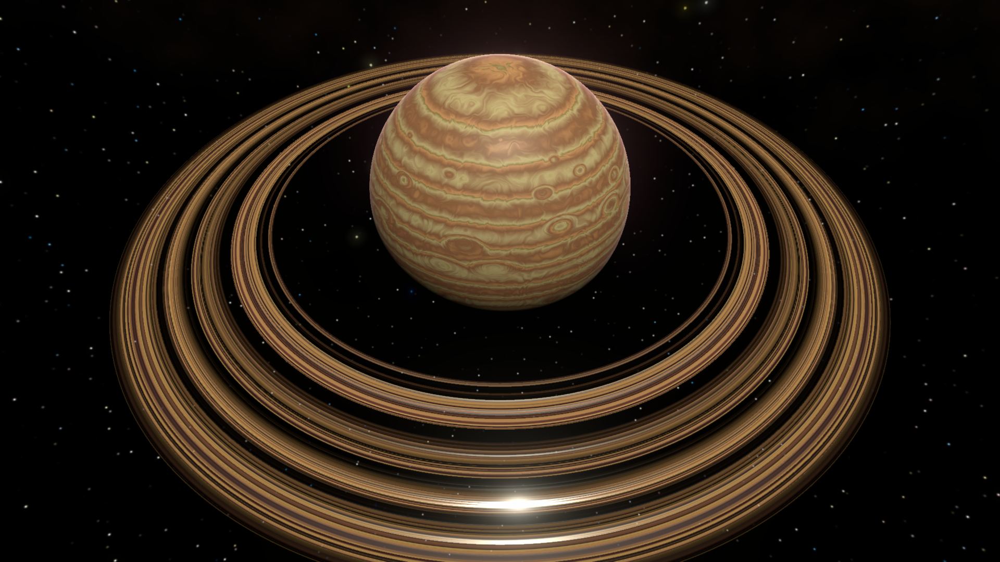

# Gas Giant Custom Lighting

This is relevant to custom lighting setup for gas giants.

For custom space lighting information, go [here](../custom-space-lighting.md).

Both flow simulation and legacy shaders support procedural smoothness and normal maps to make the gas giant
look more dynamic and planetary.

## Smoothness

Smoothness affects how shiny the sun reflections are on the gas giants. See below for a comparison photo of different
smoothness values on the same gas giant:

Smoothness is also adjustable for gas giant rings:

## Normals

Normals simulate depth on the gas giant surface, so it doesn't look like a perfectly smooth sphere. This effect is quite
muted and stands out the most on the areas of the gas giant that face away from the sun.

