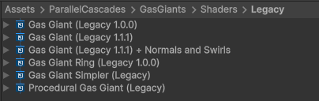
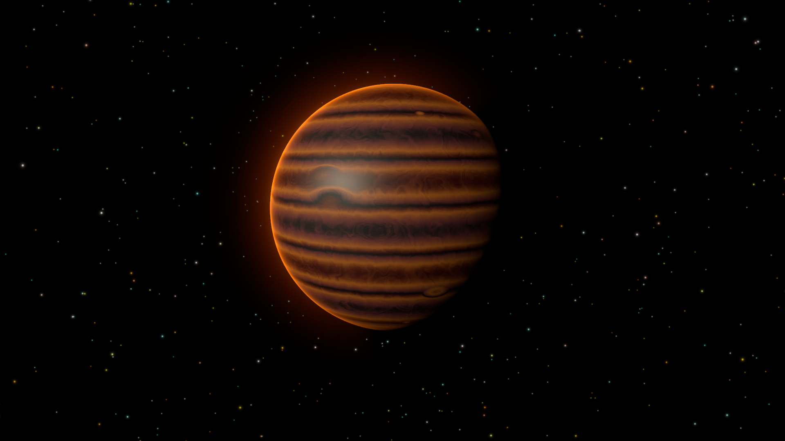
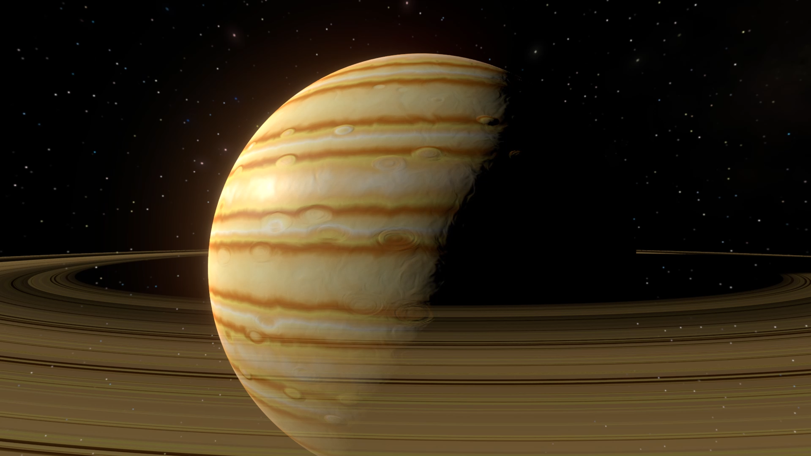

# Gas Giant Legacy Shaders

Before the simulation shaders, this framework used fully procedural shaders for the gas giants. 
These shaders are still available:

You can view a collection of thes gas giants in the Legacy Shaders sample scene.

It is recommended to create these through the "Parallel Cascades > Gas Giants > Procedural Gas Giant (Legacy)" menu item, 
as this will automatically handle the component and resources setup for you. This will use the most advanced legacy shader,
which has custom lighting, procedural smoothness and normals. If you want to use older  legacy shader, you have to change the shader in the material inspector.

Some examples of legacy shaders:

