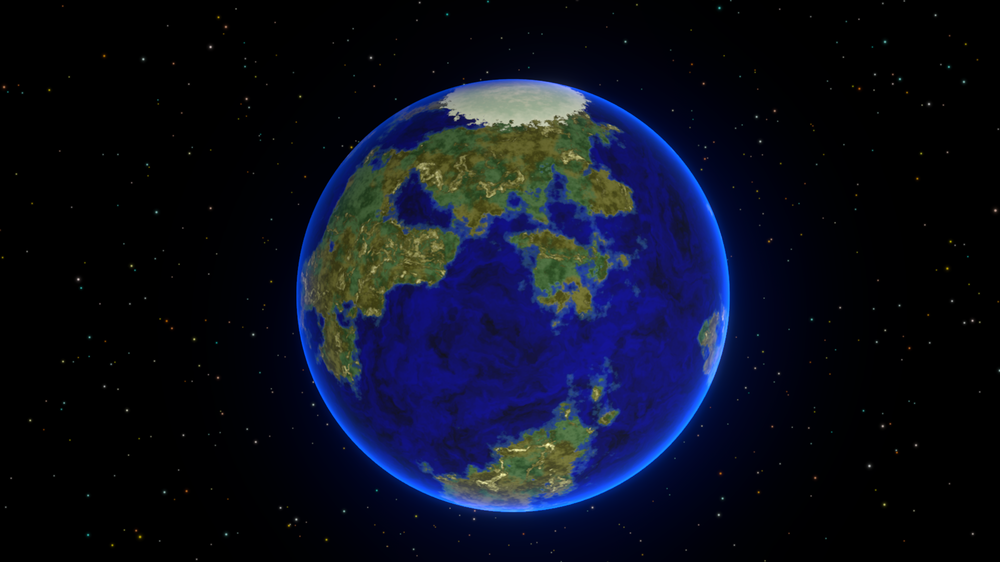

# Welcome to the Documentation for Procedural Planet Generation

Procedural Planet Generation is a Unity framework for creating procedural celestial bodies: stars, gas giants, asteroid rings, moons, and Earth-like planets.

It uses Shader Graph for procedural surface shaders, VFX Graph for star coronas, and Render Graph for atmospheric and glow post-processing effects.

This framework does NOT generate terrain or height-based geometry and does not modify meshes. It does generate procedural surface textures for lightweight, non-landable planets, suitable for space strategy games, solar system maps, background space environments, and skyboxes.

[Get Started](./get-started.md){ .md-button .md-button--primary }

/// caption
Gas Giant with Ring
///

/// caption
Moon
///

/// caption
Earth-like Planet
///

/// caption
Yellow Star with Corona VFX
///

