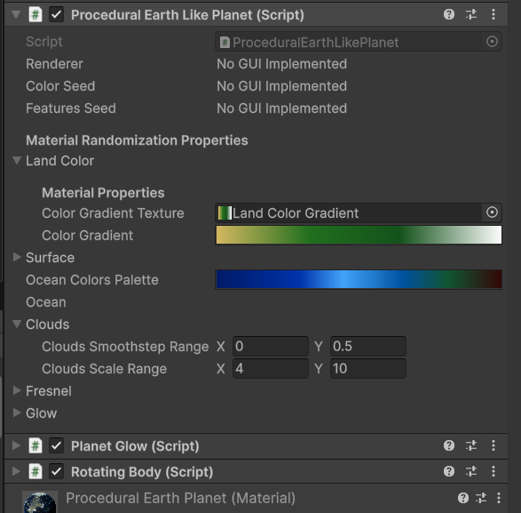

# Known Issues

## 1. Poor editor performance when using multiple flow simulation gas giants in the same scene

Particularly pronounced when using editor systems that constantly update, like the Shader Graph view. Flow
simulation gas giants constantly update in the editor in order to retain the custom render texture
state when scenes are saved - this is a temporary workaround and will be fixed in update 1.3.2.

Meanwhile, if you need to alleviate the issue, you can disable the `ProceduralGasGiantFlowSimulation` component
in the inspector while working on shaders.

## 2. Missing reference to asteroid belt material in Asteroid Belts sample scene

This has been resolved in version 1.3.1 which is pending release on the asset store.

## 3. Flickering with high-detail noise patterns when viewed from a distance.

See [Anti-Aliasing](./antialiasing.md) and [Filtering](./filtering.md). [Baked](./baking-textures.md) textures do not have this issue.

## 4. Cubemap Preview during baking showing a seam between faces

This is in fact a repeated face. This might happen if any changes have been made to the shader just prior to baking:

This only affects the preview image and will not carry over to the final rendered image and can be ignored.

## 5. VFX Skybox breaks when using Orthographic projection

The VFX skybox uses a custom function to determine where to place the star particles based on perspective camera distance. If you switch to orthographic camera the star particles will apear huge and flicker across the screen as you move the camera.

A more advanced procedural skybox solution is coming soon.

## 6. 'No GUI Implemented' shown for some custom inspector features on procedural components

Check to see if you have any stray custom editor scripts that might be ovewriting the custom
inspectors for the procedural components.
This might also be caused by incompatibility with other assets that extend the editor.

This will in fact lead to more issues, like gradients not being saved to textures permanently.

### Known incompatible assets:

#### SOAP - Scriptable Object Architecture Pattern:
There is actually a script you can delete from this asset to restore editor functionality:

Assets/Obvious/Soap/Core/Editor/ScriptableBase/ObjectEditor.cs