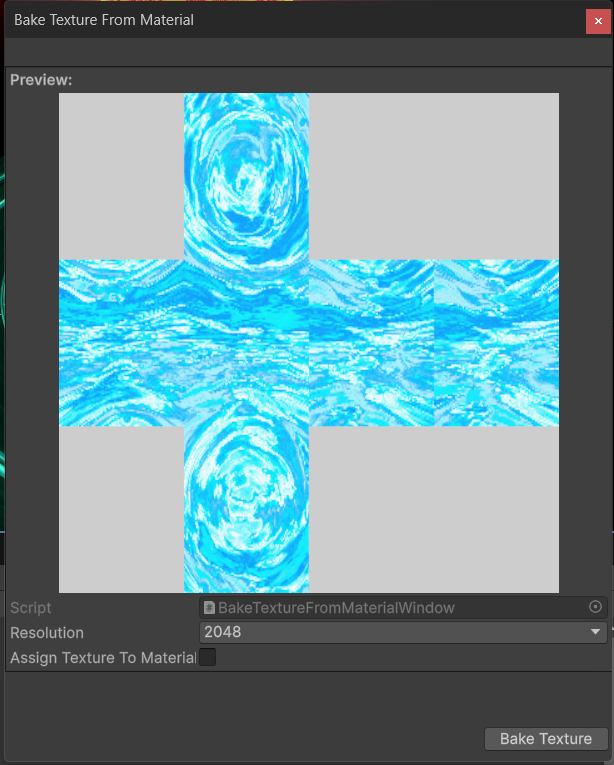
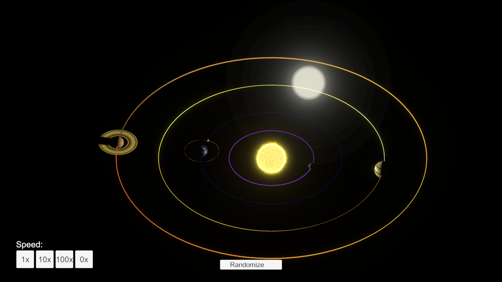

# Known Issues

## 1. Missing reference to asteroid belt material in Asteroid Belts sample scene

This has been resolved in version 1.3.1 which is pending release on the asset store.

## 2. Flickering with high-detail noise patterns when viewed from a distance.

See [Anti-Aliasing](./antialiasing.md) and [Filtering](./filtering.md). [Baked](./baking-textures.md) textures do not have this issue.

## 3. Cubemap Preview during baking showing a seam between faces

This is in fact a repeated face. This might happen if any changes have been made to the shader just prior to baking:

This only affects the preview image and will not carry over to the final rendered image and can be ignored.

## 4. VFX Skybox breaks when using Orthographic projection

The VFX skybox uses a custom function to determine where to place the star particles based on perspective camera distance. If you switch to orthographic camera the star particles will apear huge and flicker across the screen as you move the camera.

A more advanced procedural skybox solution is coming soon.