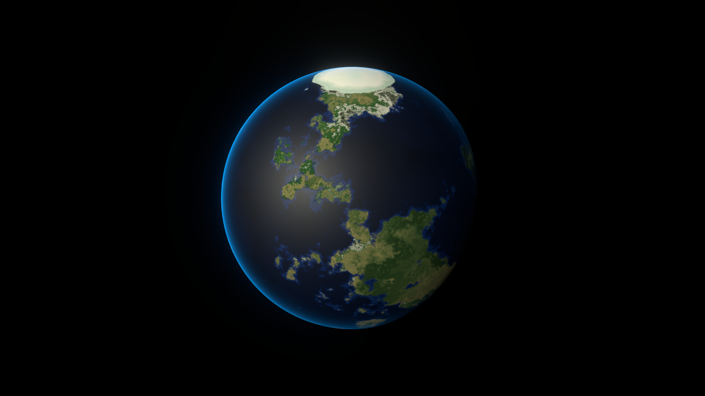
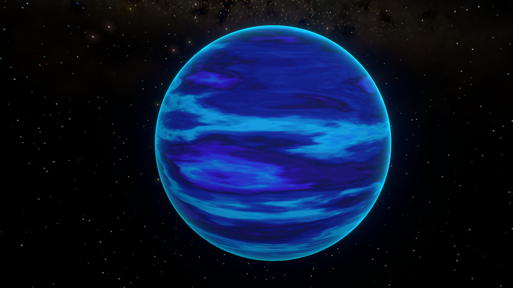

# Procedural Planet Generation Lite Samples Pack

[Procedural Planet Generation - Lite Sample Pack](https://assetstore.unity.com/packages/vfx/shaders/procedural-planet-generation-lite-sample-pack-296362) is a free asset that contains simplified versions of the shaders and effects included in the full paid system.

The Lite version includes:

* **Procedural moons** with customizable surface colors and gradient-based patterns
* **Earth-like planets** with land, oceans, ice caps, and atmospheric glow effects
* **Gas giants** with animated cloud bands and atmospheric effects
* **Asteroid rings** with procedural banding and rotation
* **Stars** with flowing molten surfaces and glow effects
* **Runtime and in-Editor randomization tools** for procedural planet generation

The full [paid version](#when-to-upgrade) adds heightmap-based normals, dynamic clouds, city lights, storm systems, VFX corona particles, static texture baking tools, custom omnidirectional lighting, and additional shader variants.

## Celestial Bodies (Lite)

### Moons

Procedural surface coloration with randomizable gradient.

#### Available Features

| Feature           | Options                                            |
| ----------------- | -------------------------------------------------- |
| **Surface Color** | Randomizabe procedural pattern, scale, color gradient, saturation |

#### Upgrade Benefits

| Feature                  | Description                                                                 |
| ------------------------ | --------------------------------------------------------------------------- |
| **Procedural Heightmaps** | Realistic surface elevation with depth                                     |
| **Normal Generation**    | Crater and ridge details visible at close range                            |

### Earth-like Planets

Simplified terrestrial planets with procedural lands and oceans and ice caps at the poles. Gradient-based surface coloring. Ocean vs land smoothness contrast. Captures the overall look of Earth-like bodies without complex terrain detail. 

Atmospheric glow post-processing effect. Shader fresnel glow at planet edges.

#### Available Features

| Feature                     | Options                                    |
| --------------------------- | ------------------------------------------ |
| **Continents** | Continent scale and overall land–ocean coverage ratio           |
| **Ice Caps**           | Maximum ice cap extent based on elevation and ice edge falloff shaping |
| **Surface Color**           | Noise pattern scale, land color gradient, saturation, ocean deep/shallow coloration |
| **Atmospheric Effects**     | Fresnel edge tint and atmospheric glow color, size, and falloff  |

#### Upgrade Benefits

| Feature                    | Description                                                               |
| -------------------------- | ------------------------------------------------------------------------- |
| **Heightmap-Driven Normals** | Realistic terrain detail with procedural surface topology               |
| **Dynamic Clouds**         | Procedurally animated cloud layers with proper lighting                   |
| **City Lights**            | Illuminated cities visible on the dark side of the planet                 |

### Gas Giants and Asteroid Rings

#### Gas Giant

Procedurally generated gas giants feature dynamic, swirling cloud bands.

Atmospheric effects with Fresnel edge glow and post-processing glow.

##### Available Features

| Feature                 | Options                                           |
| ----------------------- | ------------------------------------------------- |
| **Gas Giant Bands**     | Color gradient, band scale, flow speed            |
| **Atmospheric Effects** | Basic Fresnel edge glow                           |

##### Upgrade Benefits

| Feature              | Description                                                                  |
| -------------------- | ---------------------------------------------------------------------------- |
| **Storm Systems**    | Animated swirling storms                 |
| **Static Baking and Flowmap mode** | Capture unique procedural patterns in textures and perturb them to simulate dynamic movement with high performance         |

#### Gas Giant (Simplified)

A new simplified version of the Gas Giant has been added that has reduced visual fidelity but much improved performance. Find it under the new menu item `Parallel Cascades/Procedural Planet Generation Lite/Gas Giant (Simplified)`. This is benchmarked to have double the performance of the default Gas Giant shader. 

Asteroid rings are procedurally generated spherically banded discs that rotate around a planet. Lighting overrides allow you to control visibility at acute viewing angles.

#### Available Features

| Feature                | Options |
| ---------------------- | -------- |
| **Ring Shape**         | Inner and outer radius, edge fade strength, banding pattern defined by noise texture |
| **Color**              | Gradient sampled along the ring pattern, overall saturation|
| **Animation / Flow**   | Rotation speed of the ring pattern|
| **Lighting Overrides** | Two-sided lighting for transparency, minimum brightness level to avoid overly dark areas, light falloff sharpness to smooth shading at glancing angles |

#### Upgrade Benefits

| Feature                        | Description                                                            |
| ------------------------------ | ---------------------------------------------------------------------- |
| **Advanced Ring Transparency** | Improved alpha variations among asteroid ring bands           |

### Stars

Stars are always lit with a flowing, molten surface with HDR color variation and corona glow.

#### Available Features

| Feature             | Options                                    |
| ------------------- | ------------------------------------------ |
| **Molten Pattern**          | Domain warp scale and intensity, pattern scale, and flow speed driving the animated molten surface |
| **Color Sampling**          | Primary color gradient plus Q/R domain-warp modulation channels blended with HDR colors for complex multi-band color variation |
| **Corona Effects**  | Fresnel edge glow (color and power), unlit spherical glow density and falloff |

#### Upgrade Benefits

| Feature                     | Description                                                             |
| --------------------------- | ----------------------------------------------------------------------- |
| **VFX-Based Corona Particles** | Stunning volumetric particle effects around the star                 |
| **Static Baking and Flowmap mode** | Capture unique procedural patterns in textures and perturb them to simulate dynamic movement with high performance         |

## When to Upgrade

The full **Procedural Planet Generation** asset significantly expands on everything shown in the Lite version:

| Feature Category | What's Added |
| ---------------- | ------------ |
| **Moons & Earth-like planets** | Heightmap-based surface definition with procedural normals ajd additional features for realistic terrain detail |
| **Earth-like planets** | Dynamic clouds and city lights with procedural animation and lighting |
| **Gas Giants** | Storm systems |
| **Asteroid Rings** | Advanced transparency bands |
| **Filtering and anti-aliasing** | Improved and dynamic distance-based procedural anti-aliasing for high-detail procedural noise and normals  |
| **VFX Graph Skybox** | Very performant VFX Graph skybox system from the [Procedural Space Skybox](https://assetstore.unity.com/packages/vfx/shaders/procedural-space-skybox-295596) asset |
| **Texture baking tools** | Static texture baking for cubemaps and optimized runtime rendering with flowmap support |
| **Lighting System** | Custom omnidirectional shader lighting and runtime systems |

[Upgrade](https://assetstore.unity.com/packages/vfx/shaders/procedural-planet-generation-339842){ .md-button .md-button--primary }
