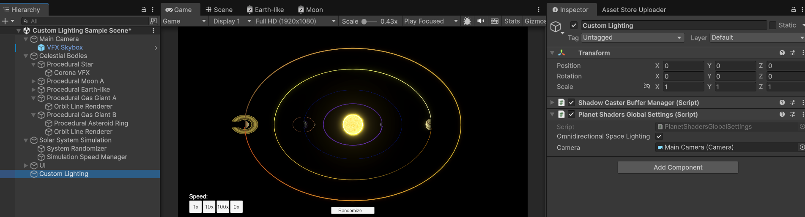

# Orthographic Camera

Since version 1.1.0 orthograhpic cameras are supported for the planet and star glow effects. This is controlled with a boolean property on the full screen shaders for these post-processing effects. To have this function correctly with camera zoom, place the Planet Shaders Global Settings script in your scene and give it a reference to your orthographic camera, and it will automatically handle the shader updates:

